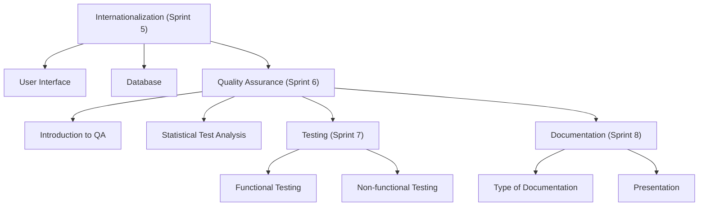

# Software Engineering Project 2

## Course Overview

The course continues the project initiated in **Software Engineering Project 1 (SEP1)**. Participation in this course is contingent upon the completion of SEP1. Throughout this course, we will delve into topics such as:

- Software localization
- Internationalization
- Quality assurance
- Project documentation

### Participation and Attendance

Achieving successful completion of the course necessitates **collaborative group efforts**. Therefore, attendance is **mandatory** during:

- Project sprint planning, implementation, and reviewing
- Lectures
- Final project demonstrations

### Course Timeline

- **Course Commencement and Initial Sprint Planning**: 4 sessions, *see the course schedule for the exact dates*
- **Sprint Conclusion and Planning Meetings**: 4 sessions, *see the course schedule for the exact dates*
- **Project Demonstrations**: 1 session

### Task Submissions

Task submissions are expected to adhere to the specified schedule. 
  - **Submissions made after the designated deadline** may only receive **half of the maximum score** for the task.

## Course Evaluation

The course evaluation is influenced by several factors, including:

- Final Exam
- Assessments of project tasks submitted via OMA, including the utilization of Trello
- Individual utilization of Git and personal commits
- Functionality of Jenkins builds, including tests and test coverage within the project
- Personal hours invested in the project
- Number of compulsory attendance sessions

### Failure Conditions

Failure to meet the required number of logged hours in Trello and the absence of visible work in Git will result in **course failure**.

## Prerequisite for OTP2  
1. You must have already passed SEP1 (OTP1). (Contact the teacher if you have not done this yet.)
2. In this course, we will continue with the same project unless you opt to change it (not recommended).
3. The same group may continue, but you also have the option to change groups.
4. We will extend the Trello board with more product backlog items, focusing on localization and both functional and non-functional testing.

---

# Course Focus

## The focus of this course is on:

1. **Internationalization (Sprint 5)**
    - User Interface
    - Database
2. **Quality Assurance (Sprint 6)**
    - Introduction to QA
    - Statistical Test Analysis
3. **Testing (Sprint 7)**
    - Functional Testing
    - Non-functional Testing
4. **Documentation (Sprint 8)**
    - Type of documentation
    - Presentation

There are 4 sprints, each lasting for two weeks. The following diagram illustrates the outline of the topics:

### Note:
- All face-to-face sessions are **compulsory**.
- Additionally, every team member must actively participate in the project development. If you encounter uncooperative team members, inform the teacher.
- **Compulsory assignments** must be submitted on time. A delay will result in a penalty.

---

### Criteria for Passing the Course:
Individual performance will be assessed as:

  **P = 0.05 × HA + 0.25 × PA + 0.70 × E**

 Where:

- **E** = Exam (50%) (compulsory)
- **PA** = Group-based project assignment (40%) (compulsory)
- **HA** = Individual assignment (10%) (compulsory)

#### Additional evaluation:
- Peer-review
- Self Evaluation

Please note that in addition to the hours scheduled in the timetable, the project must also be progressed outside of class time.

A five-credit course requires approximately **12 work hours per week (about 100 hours total)**.

Attendance during contact hours is **mandatory** unless otherwise specified.

---

## Schedule

### Schedule for Group 1 (3002):

| Date        | Sprint    | Report     | Lecture       | Assignments/Exam |
|-------------|-----------|------------|---------------|------------------|
| 21.10.2024  | Sprint 5  |            | Introduction  |                  |
| 24.10.2024  |           |            | Localization  |                  |
| 28.10.2024  |           |            |               |                  |
| 31.10.2024  |           | Review     |               |                  |
| 4.11.2024   | Sprint 6  |            | Quality       |                  |
| 7.11.2024   |           |            |               |                  |
| 11.11.2024  |           |            |               |                  |
| 14.11.2024  |           | Review     |               |                  |
| 18.11.2024  | Sprint 7  |            | Testing       |                  |
| 21.11.2024  |           |            |               |                  |
| 25.11.2024  |           |            |               |                  |
| 28.11.2024  |           | Review     |               |                  |
| 2.12.2024   | Sprint 8  |            | Documentation |                  |
| 5.12.2024   | EXAM      |            |               |                  |
| 9.12.2024   | Presentation |         |               |                  |
| 12.12.2024  | Rexam     | Review     |               |                  |

---

### Schedule for Group 2 (3005):

| Date        | Sprint    | Report     | Lecture       | Assignments/Exam |
|-------------|-----------|------------|---------------|------------------|
| 21.10.2024  | Sprint 5  |            | Introduction  |                  |
| 25.10.2024  |           |            | Localization  |                  |
| 28.10.2024  |           |            |               |                  |
| 1.11.2024   |           | Review     |               |                  |
| 4.11.2024   | Sprint 6  |            | Quality       |                  |
| 8.11.2024   |           |            |               |                  |
| 11.11.2024  |           |            |               |                  |
| 15.11.2024  |           | Review     |               |                  |
| 18.11.2024  | Sprint 7  |            | Testing       |                  |
| 22.11.2024  |           |            |               |                  |
| 25.11.2024  |           |            |               |                  |
| 29.11.2024  |           | Review     |               |                  |
| 2.12.2024   | Exam |            | Documentation |                  |
| 6.12.2024   |     |            |               |                  |
| 9.12.2024   | Presentation |         |               |                  |
| 13.12.2024  | Rexam     | Review     |               |                  |

---

### Sprint Review and Planning Meetings

**Note**: All team members must participate during the review sessions.

