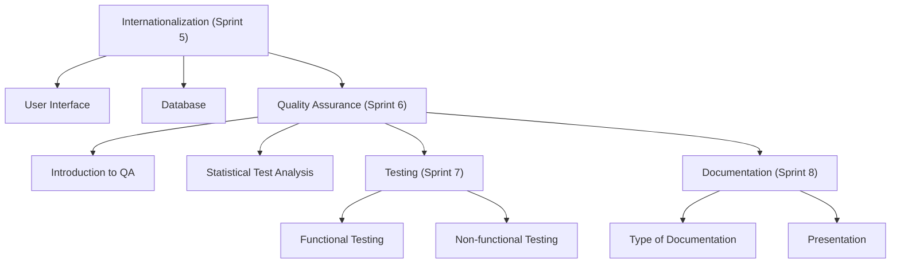

# OTP2_LectureMaterial

## The focus of this course is on:

  1. Internationalization (Sprint 5)
      - User Interface
      - Database
  2.  Quality assurance (Sprint 6)
      - Introduction QA
      - Statistical Test Analysis

  3. Testing (Spring 7)
       - Functional Testing
       - None-functional
  
  4. Documentation (Sprint 8)
       - Type of documentation
       - Presentation  

There are 4 sprints, each lasting for two weeks. The following figure illustrate the outline of the topics
