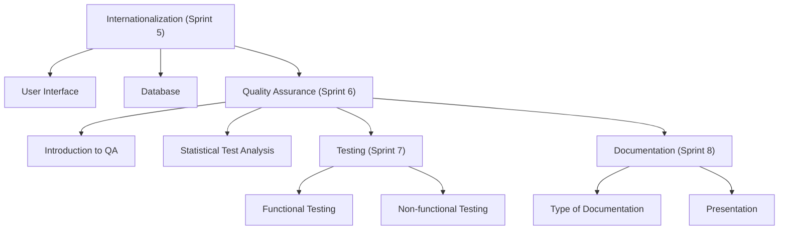

# OTP2_LectureMaterial

```mermaid
flowchart TD
    A["Internationalization (Sprint 5)"] --> B["User Interface"]
    A --> C["Database"]
    A --> D["Quality Assurance (Sprint 6)"]

    D --> E["Introduction to QA"]
    D --> F["Statistical Test Analysis"]
    D --> G["Testing (Sprint 7)"]

    G --> H["Functional Testing"]
    G --> I["Non-functional Testing"]

    D --> J["Documentation (Sprint 8)"]

    J --> K["Type of Documentation"]
    J --> L["Presentation"]


```
