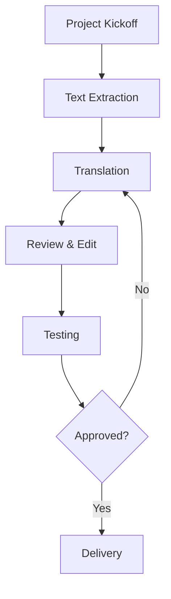

# 

# Introduction to Software Internationalization, Localization, Software Analysis, and Related Concepts

### Internationalization

Internationalization is the process of designing software products that meet the linguistic, cultural, and technical requirements of different countries and regions. 

Globalization has made it essential for software products to be accessible and user-friendly across different languages, regions, and cultures. The process of designing software without hard-coded assumptions based on locale is known as internationalization (i18n).

Internationalization prepares the software for localization (l10n), which involves adapting it to specific languages and regions. Properly internationalized software allows for smooth localization with minimal changes to the core codebase.

`Figure 1 present the most of the top 25 world languages`

> 

 [reference](https://mettahu.wordpress.com/2013/10/08/your-native-language-dictates-your-habits-of-mind/)
#### Benefits of Internationalization:

- Increase accessibility
- Improve user experience (saves time, cost, speaks the user's language)
- Improve market penetration and hence revenue
 
#### Key Concepts:
- Internationalization (i18n): The process of designing software in a way that makes it adaptable to different locales without changing the codebase significantly. It involves setting up support for multiple languages, cultural formats, and region-specific conventions.

- Localization (l10n): Adapting the software for specific locales, including translation, cultural adjustments, and regional formatting (like date, time, and currency).

- Globalization (g11n): The overarching process that encompasses both internationalization and localization, enabling software to function and be relevant worldwide.

#### Goals of Internationalization
- Separating Content from Code: Ensure that text, images, and locale-specific elements (dates, currency formats) are stored separately from the code. This allows translators and regional experts to modify content without changing the code.

- Supporting Multiple Locales: Build flexible structures that support various character sets (e.g., UTF-8 for multilingual text), date formats, and regional conventions.

- Minimal Codebase Changes: By structuring code with internationalization in mind, changes made for one locale should not require a significant overhaul of the code for other locales.

#### Steps in the Internationalization Process

4.1 Planning and Strategy
Identify the target regions and languages.
Plan for cultural differences that may affect user experience, such as reading order (left-to-right vs. right-to-left), number formats, and UI elements.

4.2 Text and Content Handling
Externalize Text Strings: Move all user-facing text to external files or databases, typically in formats like JSON, XML, or .properties files.
Use Locale-Aware Formatting: Implement libraries or functions for date, time, and currency formatting that automatically adjust based on the user’s locale.

4.3 Coding Standards
Avoid hard-coded strings and locale-specific information in the codebase.
Use locale identifiers (e.g., en_US for US English, fr_FR for French in France) to dynamically load the correct resources.
Right-to-Left (RTL) Support: Ensure that the UI can handle both left-to-right and right-to-left text display where needed (e.g., for Arabic or Hebrew).

4.4 Testing for Internationalization
Pseudolocalization: Replace text with expanded or modified versions (e.g., adding accents or extra characters) to test text overflow and layout flexibility.
Language Testing: Test translations in each target language to ensure they display correctly and fit within the design.
Functional Testing: Verify that locale-specific data (dates, times, currencies) displays correctly and that the application logic is locale-independent.

---

# **Learning Material: Web and Mobile Traffic Share in the Global Market**

---

### **1. Introduction**
With the rise of smartphones, tablets, and other portable devices, mobile traffic has become a significant portion of overall web traffic globally. Understanding the distribution between mobile and desktop web traffic is crucial for digital marketing, web development, and user experience design.

---

### **2. Key Concepts**

- **Web Traffic**: The amount of data sent and received by visitors to a website. It can be categorized based on device types such as mobile, desktop, and tablet.
- **Mobile Traffic**: Data generated by users accessing the internet through mobile devices (smartphones and tablets).
- **Desktop Traffic**: Data generated by users accessing the internet from desktop or laptop computers.

---

### **3. Current Global Web and Mobile Traffic Share (as of 2023)**

- **Mobile Traffic**: Mobile devices account for approximately **59%** of total global web traffic.
- **Desktop Traffic**: Desktop accounts for around **39%**, while tablets make up the remaining **2%**.
- **Growth Trends**: Mobile traffic share has increased steadily over the past decade, while desktop traffic has seen a gradual decline as mobile technology and internet access have improved.

[See the trend](https://www.mobiloud.com/blog/what-percentage-of-internet-traffic-is-mobile#:~:text=Mobile%20makes%20up%2058.21%25%20of,up%2037%25%20of%20total%20traffic.)

---

### **4. Regional Breakdown**

- **Asia-Pacific**: Leads in mobile traffic, with around 70-75% of all web traffic on mobile. This is driven by the high rate of smartphone penetration and internet accessibility in countries like India, China, and Indonesia.
- **North America and Europe**: While mobile traffic is significant, desktop usage remains comparatively higher, with a near 50/50 split. High-speed internet connections and traditional web habits contribute to desktop usage.
- **Africa and Middle East**: Mobile accounts for over 75% of web traffic in many African countries, largely due to limited desktop access and the popularity of mobile internet.
- **Latin America**: Similar to Asia, Latin America shows high mobile traffic, with about 65% of web usage coming from mobile.

[Fig_ref](https://telecomlead.com/4g-lte/ericsson-mobility-report-forecasts-exponential-growth-in-global-mobile-data-traffic-113635)

---

### **5. Factors Influencing Web and Mobile Traffic Share**

1. **Smartphone Penetration**: Higher smartphone ownership correlates with increased mobile traffic.
2. **Internet Accessibility**: Regions with limited broadband access often rely more on mobile networks for internet usage.
3. **Mobile Optimization**: Websites and applications optimized for mobile increase user engagement on mobile devices.
4. **Cultural and Economic Factors**: Cultural internet usage habits and economic factors affect whether people access the internet via mobile or desktop.
5. **Social Media and App Usage**: The rise of mobile apps, especially social media and e-commerce, drives users to mobile devices.
6. **5G and Faster Mobile Internet**: The expansion of 5G networks supports faster, more reliable mobile internet, encouraging mobile usage.

[Fig_Ref](https://www.statista.com/statistics/272014/global-social-networks-ranked-by-number-of-users/)
---

### **6. Future Projections and Trends**

- **Continued Mobile Dominance**: Mobile traffic share is expected to continue growing, reaching around 65-70% by 2025 as mobile internet infrastructure improves globally.
- **Desktop Stability in Some Regions**: Despite the rise of mobile, desktop traffic may remain stable in regions with strong broadband infrastructure and established desktop user bases.
- **Increasing Role of Tablets**: Tablets may see minor growth in traffic share, especially with the increased use of tablets for educational and professional purposes.

---

### **7. Practical Implications**

1. **Mobile-First Approach**: For businesses and developers, adopting a mobile-first approach in web design and content is essential for optimizing user experience and engagement.
2. **SEO for Mobile**: Search engine optimization (SEO) strategies should prioritize mobile, as search engines like Google rank mobile-friendly sites higher.
3. **App Development**: Many businesses find value in developing dedicated mobile applications, as these often yield better engagement than mobile websites.

---

### **8. Case Study: Comparing Mobile vs. Desktop Usage by Industry**

- **Retail and E-commerce**: Mobile dominates with over 65% of traffic, reflecting the ease of online shopping on mobile.
- **Finance**: Desktop usage is higher due to security and functionality needs, though mobile banking apps are increasingly popular.
- **Media and Entertainment**: Mobile traffic is dominant, with streaming platforms, social media, and news consumed more on mobile devices.

---

### **9. Conclusion**

The web and mobile traffic share is a dynamic metric that reflects technological, economic, and cultural shifts. With the growth of mobile devices and network advancements, mobile traffic is poised to dominate further. Companies and web developers must adopt mobile-first strategies to capture the growing mobile user base and optimize for regional differences.

---

This GitHub-compatible file includes YAML metadata at the top and is ready to be used as a `.md` file on GitHub.

## Software Localization

Software localization is the process of adapting software to meet the language, cultural, and technical requirements of a specific target market. It involves more than just translating the user interface (UI) text; it also requires modifications to aspects like date formats, currency, and even user experience elements. The goal of software localization is to make the software feel natural to users in different regions, ensuring that it operates seamlessly within their cultural context.

## Software Analysis

Software analysis refers to the examination and evaluation of software applications to understand their structure, functionality, and behavior. This can include code analysis, requirements analysis, and architectural analysis, among others. The purpose of software analysis is to identify potential improvements, detect bugs, ensure adherence to requirements, and evaluate the overall performance and maintainability of the software.

## UI Localization

UI localization is a critical subset of software localization. It focuses specifically on adapting the user interface elements of the software to meet the linguistic and cultural needs of the target audience. This includes translating menus, dialogs, and error messages, as well as adjusting layout and design to accommodate different text lengths and reading directions.

## Database Localization

Database localization involves adapting the data stored in a software application's database to align with the localized needs of different markets. This might include translating text-based data, adjusting date and time formats, converting measurement units, and ensuring that the database can handle different character encodings. Proper database localization is essential for maintaining data integrity and usability across multiple regions.

## Software Functional and Non-Functional Testing

### Functional Testing
Functional testing is a type of testing that ensures that the software operates according to the specified requirements. This includes testing individual functions, user commands, data manipulation, searches, and business processes. The goal is to verify that the software behaves as expected under normal conditions.

### Non-Functional Testing
Non-functional testing, on the other hand, examines aspects of the software that may not be directly related to specific functions or features. This includes performance testing, security testing, usability testing, and compatibility testing. Non-functional testing ensures that the software meets quality standards and provides a good user experience.

## Database Documentation

Database documentation is the practice of creating and maintaining records that describe the structure, relationships, constraints, and other aspects of a database. This documentation is crucial for developers, database administrators, and other stakeholders to understand the database design and ensure its correct and efficient use. Well-documented databases are easier to maintain, update, and debug, which contributes to the overall reliability of the software application.

...
