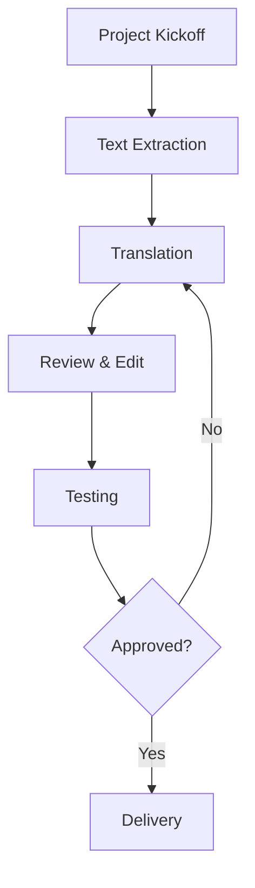

# 

# Introduction to Software Internationalization, Localization, Software Analysis, and Related Concepts

### Internationalization

Internationalization is the process of designing software products that meet the linguistic, cultural, and technical requirements of different countries and regions. 

Globalization has made it essential for software products to be accessible and user-friendly across different languages, regions, and cultures. The process of designing software without hard-coded assumptions based on locale is known as internationalization (i18n).

Internationalization prepares the software for localization (l10n), which involves adapting it to specific languages and regions. Properly internationalized software allows for smooth localization with minimal changes to the core codebase.

`Figure 1 present the most of the top 25 world languages`

> 

 [reference](https://mettahu.wordpress.com/2013/10/08/your-native-language-dictates-your-habits-of-mind/)
#### Benefits of Internationalization:

- Increase accessibility
- Improve user experience (saves time, cost, speaks the user's language)
- Improve market penetration and hence revenue
 
#### Key Concepts:
- Internationalization (i18n): The process of designing software in a way that makes it adaptable to different locales without changing the codebase significantly. It involves setting up support for multiple languages, cultural formats, and region-specific conventions.

- Localization (l10n): Adapting the software for specific locales, including translation, cultural adjustments, and regional formatting (like date, time, and currency).

- Globalization (g11n): The overarching process that encompasses both internationalization and localization, enabling software to function and be relevant worldwide.

  > 

#### Goals of Internationalization
- Separating Content from Code: Ensure that text, images, and locale-specific elements (dates, currency formats) are stored separately from the code. This allows translators and regional experts to modify content without changing the code.

- Supporting Multiple Locales: Build flexible structures that support various character sets (e.g., UTF-8 for multilingual text), date formats, and regional conventions.

- Minimal Codebase Changes: By structuring code with internationalization in mind, changes made for one locale should not require a significant overhaul of the code for other locales.

#### Steps in the Internationalization Process

1. Planning and Strategy
Identify the target regions and languages.
Plan for cultural differences that may affect user experience, such as reading order (left-to-right vs. right-to-left), number formats, and UI elements.

2. Text and Content Handling
Externalize Text Strings: Move all user-facing text to external files or databases, typically in formats like JSON, XML, or .properties files.
Use Locale-Aware Formatting: Implement libraries or functions for date, time, and currency formatting that automatically adjust based on the user’s locale.

3. Coding Standards
Avoid hard-coded strings and locale-specific information in the codebase.
Use locale identifiers (e.g., en_US for US English, fr_FR for French in France) to dynamically load the correct resources.
Right-to-Left (RTL) Support: Ensure that the UI can handle both left-to-right and right-to-left text display where needed (e.g., for Arabic or Hebrew).

4. Testing for Internationalization
Pseudolocalization: Replace text with expanded or modified versions (e.g., adding accents or extra characters) to test text overflow and layout flexibility.
Language Testing: Test translations in each target language to ensure they display correctly and fit within the design.
Functional Testing: Verify that locale-specific data (dates, times, currencies) displays correctly and that the application logic is locale-independent.


#### Common Challenges and Solutions
- Text Expansion: Some languages take up more space than English. Design interfaces with flexible layouts to accommodate expanded text.

- Cultural Sensitivity: Be mindful of colors, images, symbols, and phrases that may have different meanings in other cultures.

- Right-to-Left (RTL) Support: For languages written from right to left, adjust text alignment and UI elements accordingly.

- Currency, Date, and Number Formatting: Use libraries or APIs that automatically handle locale-specific formatting for these elements, reducing the need for custom code.
-----------------------------------------------------------------

# Localization Challenges: Mistranslations and Cultural Figures

Localization challenges, particularly due to mistranslations or cultural differences in figures and symbols, can have significant impacts on communication, marketing, and product success. Here are some examples across different industries and contexts.

## 1. Product Names and Slogans

- **Chevrolet Nova in Latin America**: Chevrolet's "Nova" didn't sell well in Spanish-speaking countries because "No va" translates to "it doesn't go." This name was perceived as an ironic choice for a car.
- **KFC in China**: When KFC first entered China, their famous slogan "Finger-Lickin' Good" was mistranslated to "Eat your fingers off," causing confusion and initial negative reactions.
- **Coors Beer in Spain**: Coors' slogan "Turn It Loose" was mistranslated in Spanish to "Suffer from Diarrhea," which had a humorous but damaging impact on its brand.

## 2. Cultural Symbols and Figures

- **Numbers in East Asia**: In countries like China, Japan, and Korea, the number 4 is considered unlucky because its pronunciation is similar to the word for "death." Brands using this number in marketing (e.g., pricing or model names) may encounter resistance in these markets.
- **Pepsi in Southeast Asia**: Pepsi’s blue can design, intended as a rebranding effort, ran into issues in Southeast Asia, where blue is traditionally associated with death and mourning.
- **Nike in Arab Countries**: Nike once had to recall thousands of shoes because the logo resembled the Arabic word for "Allah." This was perceived as disrespectful and offensive in Muslim-majority countries.

## 3. Figures and Icons

- **Apple's "OK" Hand Emoji in Brazil**: The "OK" hand gesture (thumb and index finger forming a circle) is seen as positive in many countries, but in Brazil, it’s an obscene gesture. Using this in marketing or in user interfaces caused issues.
- **Red and White Color Scheme in Africa**: Coca-Cola’s traditional red and white color scheme faced difficulties in parts of Africa, where red is associated with death and mourning.

## 4. Media and Entertainment

- **Harry Potter in Russia**: The name of Voldemort was changed in the Russian translation because "Voldemort" sounds similar to an offensive phrase in Russian, necessitating a careful localization.
- **Cultural References in Movies**: Many Hollywood movies with culturally specific references are hard to localize. For example, the U.S. film *Zootopia* renamed the character "Fru Fru the Shrew" to "Fifi" in France to avoid associations with a negative French term.
- **Frozen (Disney)**: In many countries, the song "Let It Go" from *Frozen* was localized with culturally relevant expressions, but in some markets, the translations deviated from the original meaning, causing confusion among audiences.

## 5. UI/UX Localization Issues

- **Airbnb’s Mistranslated Instructions**: Airbnb once had an issue where localization into Japanese failed due to improper translations of house rules, which led to confusion among Japanese users.
- **Google’s Auto-suggestions**: In some languages, Google's auto-suggestions didn’t work as expected because the algorithms weren’t accounting for gender-based or plural forms specific to those languages.

## 6. Gestures and Body Language

- **Thumbs Up in Middle Eastern Countries**: While the thumbs-up gesture is positive in most Western cultures, in certain Middle Eastern countries, it is seen as highly offensive, causing a challenge for marketing that incorporates hand gestures.
- **Pointing with Finger in China and Japan**: Pointing directly at someone with a finger is considered rude in China and Japan. A localization challenge could occur if figures or characters are depicted pointing at the user in digital interfaces or ads.

## 7. Food and Beverage Industry

- **Gerber Baby Food in Africa**: When Gerber first introduced baby food to certain African markets, they used their typical packaging featuring a baby on the label. However, in many parts of Africa, it is common for labels to depict the contents of the package, leading some consumers to believe the jars contained baby meat.
- **Puffs Tissues in Germany**: The brand "Puffs" ran into trouble in Germany because "puff" is a colloquial term for a brothel, which hurt the product’s image and caused confusion.

## 8. Calendar and Time Format

- **Date Formats**: In the U.S., the date format is typically MM/DD/YYYY, while in many European and Asian countries, it is DD/MM/YYYY or even YYYY/MM/DD. This can cause significant confusion in scheduling, documentation, and event promotion.
- **Weekend Days**: In the Middle East, the weekend days are Friday and Saturday, unlike the Saturday-Sunday pattern in most Western countries. Marketing campaigns or international meetings scheduled on weekends in Western countries can conflict with working days in the Middle East.

## 9. Religious and Cultural Sensitivities

- **Proctor & Gamble Moon Logo**: P&G had to change its logo in the Middle East, which depicted a man-in-the-moon symbol. Some customers mistakenly believed it contained hidden satanic symbols, causing a public backlash.
- **Meat Products in India**: When launching in India, McDonald's had to drastically alter its menu to exclude beef due to religious practices surrounding cows, which are sacred in Hinduism. Offering beef in a predominantly Hindu market would have been a major cultural faux pas.

## 10. Music Lyrics and Tone

- **Marketing Jingles in China**: Western brands often use catchy jingles in ads, but the use of certain notes or musical intervals can convey very different emotional tones in Chinese culture. For instance, tones in Mandarin and Cantonese languages can change the meaning of the same syllables dramatically.
- **Pepsi’s Taiwan Jingle**: Pepsi's ad slogan, "Come Alive with the Pepsi Generation," was mistranslated in Taiwan to mean "Pepsi brings your ancestors back from the dead," causing discomfort among consumers.

---

Localization challenges often arise due to linguistic nuances, cultural differences, or even symbolic meanings of figures or gestures. Successful global expansion requires companies to carefully adapt products, messaging, and designs to local markets, ensuring that translation and cultural sensitivities are taken into account.


--------------------------------------------------------------


#### Best Practices for Internationalization
- Design a Flexible UI: Create a responsive, adaptable layout that can handle variations in text length, date formats, and RTL languages.

- Use Standard Libraries: Leverage internationalization libraries (e.g., i18next for JavaScript, gettext for Python) to manage translations, formatting, and locale data.

- Regularly Test with Different Locales: Test using various locales to catch potential issues early. Pseudolocalization is useful for identifying layout and text issues before translations are available.

- Documentation for Localization Teams: Provide guidelines to localization teams on character limits, UI constraints, and cultural nuances.


#### Key Elements to Localize
- Localization involves a wide range of elements, from the visible text and images to the underlying technical details. Below are the essential components to consider in a localization strategy.
#### Language and Text

1 Text Translation
- User Interface (UI) Text: All UI elements, including menus, buttons, labels, alerts, and notifications, need translation to ensure a smooth user experience.
- Help and Support Content: Translate FAQ pages, help documentation, and support articles so users can access self-help resources in their preferred language.
- Error Messages: Localized error messages improve user comprehension and troubleshooting.

2 Tone and Style
- Cultural Tone: Adapt the tone to fit local customs (e.g., using formal vs. informal address, adjusting humor, or considering politeness).
- Idiomatic Expressions: Replace idioms, slang, and metaphors with regionally appropriate alternatives.

3 Text Layout and Expansion
- Text Expansion: Account for languages that may take up more space than English (e.g., German or Russian).
- Right-to-Left (RTL) Languages: Adjust text and UI layout to support RTL languages like Arabic and Hebrew.

2. Visual Content
- Images and Graphics
  -- Cultural Relevance: Modify images to reflect local culture, fashion, food, and other visual cues.
 -- Icons and Symbols: Ensure icons have consistent meanings across cultures (e.g., a thumbs-up symbol may not be positive in all regions).
 -- Avoid Sensitive Content: Avoid visuals that may be offensive or inappropriate in certain regions due to cultural, religious, or political sensitivities.
  
- Videos and Multimedia
  
  -- Subtitles and Captions: Provide translations for all spoken content, including video subtitles and captions.
  
  -- Voiceovers and Dubbing: Consider local voiceovers or dubbing to make audio content more relatable and accessible.

3. Date, Time, and Number Formatting
- Date Formats
  
  -- Adapt date formats to the local standards (e.g., MM/DD/YYYY in the U.S. vs. DD/MM/YYYY in Europe). Make sure the user sees dates in a familiar format.
  
- Time Zones
  -- Display times based on the user’s local time zone, especially for scheduling features, notifications, and updates.
  
- Number Formatting
  -- Adapt number formats, including decimal separators (commas vs. dots) and thousands separators based on locale.
  
- Currency
  -- Display prices in the local currency and ensure conversions are accurate. Use symbols and currency codes to avoid confusion

4. Units of Measurement
- Adapt units of measurement to match local conventions, such as kilometers vs. miles, Celsius vs. Fahrenheit, liters vs. gallons, etc.
- Ensure that unit conversions are accurate and avoid confusion for users by clearly indicating the units used.

5. Legal and Regulatory Compliance
- Privacy Policies and Terms of Service
  -- Localize legal documents to comply with regional laws, such as GDPR in Europe or CCPA in California, and translate privacy policies and terms for clarity.
- Content Restrictions
  -- Adapt content to comply with local regulations regarding media, advertising, and restricted content (e.g., gambling laws or age restrictions).
- Data Localization
  -- Ensure that data storage and processing comply with local laws and regulations on data localization and cross-border data transfers.

5. Payment Methods and E-commerce Localization
- Local Payment Methods
  -- Integrate regionally popular payment methods like credit cards, PayPal, mobile wallets (e.g., WeChat Pay in China, UPI in India), and bank transfers.
- Tax and Pricing Information
  -- Display prices with local tax information and ensure that regional taxes (e.g., VAT in the EU) are calculated correctly.
- Shipping and Delivery Information
  -- Provide accurate shipping information and delivery options based on the region. Include local carriers and estimate delivery times accordingly.


6. User Interface (UI) and User Experience (UX) Adaptation
- Layout Adjustments
  -- Consider layout changes based on language (e.g., longer words in German or French might need more space).
  -- Support RTL layouts where needed for a seamless experience in RTL languages.
- Cultural Preferences
  -- Adjust color schemes and design elements based on local cultural preferences. Colors may carry different symbolic meanings across cultures (e.g., red for good luck in China but caution in Western cultures).
- Interactive Elements
  -- Ensure culturally appropriate interactions, such as the placement of action buttons, flow of interactions, and feedback behaviors that may vary across cultures.


#### Testing for Localization
1. Linguistic Testing
Verify that translations are accurate, culturally appropriate, and contextually correct.

2. Functional Testing
Test that localized elements (currency, time zone, and payment methods) work correctly within the application.

3. User Acceptance Testing (UAT)
Conduct usability testing with local users to identify any cultural or linguistic nuances that may affect user experience.
---

# **Learning Material: Web and Mobile Traffic Share in the Global Market**

---

### **1. Introduction**
With the rise of smartphones, tablets, and other portable devices, mobile traffic has become a significant portion of overall web traffic globally. Understanding the distribution between mobile and desktop web traffic is crucial for digital marketing, web development, and user experience design.

---

### **2. Key Concepts**

- **Web Traffic**: The amount of data sent and received by visitors to a website. It can be categorized based on device types such as mobile, desktop, and tablet.
- **Mobile Traffic**: Data generated by users accessing the internet through mobile devices (smartphones and tablets).
- **Desktop Traffic**: Data generated by users accessing the internet from desktop or laptop computers.

---

### **3. Current Global Web and Mobile Traffic Share (as of 2023)**

- **Mobile Traffic**: Mobile devices account for approximately **59%** of total global web traffic.
- **Desktop Traffic**: Desktop accounts for around **39%**, while tablets make up the remaining **2%**.
- **Growth Trends**: Mobile traffic share has increased steadily over the past decade, while desktop traffic has seen a gradual decline as mobile technology and internet access have improved.

[See the trend](https://www.mobiloud.com/blog/what-percentage-of-internet-traffic-is-mobile#:~:text=Mobile%20makes%20up%2058.21%25%20of,up%2037%25%20of%20total%20traffic.)

---

### **4. Regional Breakdown**

- **Asia-Pacific**: Leads in mobile traffic, with around 70-75% of all web traffic on mobile. This is driven by the high rate of smartphone penetration and internet accessibility in countries like India, China, and Indonesia.
- **North America and Europe**: While mobile traffic is significant, desktop usage remains comparatively higher, with a near 50/50 split. High-speed internet connections and traditional web habits contribute to desktop usage.
- **Africa and Middle East**: Mobile accounts for over 75% of web traffic in many African countries, largely due to limited desktop access and the popularity of mobile internet.
- **Latin America**: Similar to Asia, Latin America shows high mobile traffic, with about 65% of web usage coming from mobile.


[Fig_ref](https://telecomlead.com/4g-lte/ericsson-mobility-report-forecasts-exponential-growth-in-global-mobile-data-traffic-113635)

---

### **5. Factors Influencing Web and Mobile Traffic Share**

1. **Smartphone Penetration**: Higher smartphone ownership correlates with increased mobile traffic.
2. **Internet Accessibility**: Regions with limited broadband access often rely more on mobile networks for internet usage.
3. **Mobile Optimization**: Websites and applications optimized for mobile increase user engagement on mobile devices.
4. **Cultural and Economic Factors**: Cultural internet usage habits and economic factors affect whether people access the internet via mobile or desktop.
5. **Social Media and App Usage**: The rise of mobile apps, especially social media and e-commerce, drives users to mobile devices.
6. **5G and Faster Mobile Internet**: The expansion of 5G networks supports faster, more reliable mobile internet, encouraging mobile usage.


[Fig_Ref](https://www.statista.com/statistics/272014/global-social-networks-ranked-by-number-of-users/)
---

### **6. Future Projections and Trends**

- **Continued Mobile Dominance**: Mobile traffic share is expected to continue growing, reaching around 65-70% by 2025 as mobile internet infrastructure improves globally.
- **Desktop Stability in Some Regions**: Despite the rise of mobile, desktop traffic may remain stable in regions with strong broadband infrastructure and established desktop user bases.
- **Increasing Role of Tablets**: Tablets may see minor growth in traffic share, especially with the increased use of tablets for educational and professional purposes.

---

### **7. Practical Implications**

1. **Mobile-First Approach**: For businesses and developers, adopting a mobile-first approach in web design and content is essential for optimizing user experience and engagement.
2. **SEO for Mobile**: Search engine optimization (SEO) strategies should prioritize mobile, as search engines like Google rank mobile-friendly sites higher.
3. **App Development**: Many businesses find value in developing dedicated mobile applications, as these often yield better engagement than mobile websites.

---

### **8. Case Study: Comparing Mobile vs. Desktop Usage by Industry**

- **Retail and E-commerce**: Mobile dominates with over 65% of traffic, reflecting the ease of online shopping on mobile.
- **Finance**: Desktop usage is higher due to security and functionality needs, though mobile banking apps are increasingly popular.
- **Media and Entertainment**: Mobile traffic is dominant, with streaming platforms, social media, and news consumed more on mobile devices.

---

### **9. Conclusion**

The web and mobile traffic share is a dynamic metric that reflects technological, economic, and cultural shifts. With the growth of mobile devices and network advancements, mobile traffic is poised to dominate further. Companies and web developers must adopt mobile-first strategies to capture the growing mobile user base and optimize for regional differences.

---

This GitHub-compatible file includes YAML metadata at the top and is ready to be used as a `.md` file on GitHub.


## Software Localization

Software localization is the process of adapting software to meet the language, cultural, and technical requirements of a specific target market. It involves more than just translating the user interface (UI) text; it also requires modifications to aspects like date formats, currency, and even user experience elements. The goal of software localization is to make the software feel natural to users in different regions, ensuring that it operates seamlessly within their cultural context.



## Software Analysis

Software analysis refers to the examination and evaluation of software applications to understand their structure, functionality, and behavior. This can include code analysis, requirements analysis, and architectural analysis, among others. The purpose of software analysis is to identify potential improvements, detect bugs, ensure adherence to requirements, and evaluate the overall performance and maintainability of the software.

## UI Localization

UI localization is a critical subset of software localization. It focuses specifically on adapting the user interface elements of the software to meet the linguistic and cultural needs of the target audience. This includes translating menus, dialogs, and error messages, as well as adjusting layout and design to accommodate different text lengths and reading directions.

## Database Localization

Database localization involves adapting the data stored in a software application's database to align with the localized needs of different markets. This might include translating text-based data, adjusting date and time formats, converting measurement units, and ensuring that the database can handle different character encodings. Proper database localization is essential for maintaining data integrity and usability across multiple regions.

## Software Functional and Non-Functional Testing

### Functional Testing
Functional testing is a type of testing that ensures that the software operates according to the specified requirements. This includes testing individual functions, user commands, data manipulation, searches, and business processes. The goal is to verify that the software behaves as expected under normal conditions.

### Non-Functional Testing
Non-functional testing, on the other hand, examines aspects of the software that may not be directly related to specific functions or features. This includes performance testing, security testing, usability testing, and compatibility testing. Non-functional testing ensures that the software meets quality standards and provides a good user experience.

_____________________________

# Localization in Java
In Java, a resource bundle is a way to manage locale-specific resources, such as text messages or user interface components, allowing internationalization (i18n) of applications. It enables the application to adapt to different languages and regions by providing locale-specific resources like strings, dates, or numbers in separate files. These bundles are typically stored as property files (.properties) or Java classes.

## ResourseBundle in Java

 

### 1. ListResourceBundle
ListResourceBundle is an abstract class that stores key-value pairs in Java code, using arrays. It's primarily used when you want to define resources directly in Java rather than in external properties files. It is implemented as a class with Object[][] to store key-value pairs.

**Key Features:**
 - Keys and values are stored in Java code.
 - More flexible than PropertyResourceBundle, as you can define complex objects or even use logic to produce resource values.
 - Resource keys must be strings, but values can be any Object.

## Key Concepts:
 - *Base Name:* The common name used for the resource bundle, which is shared by all locale-specific variants.
 - *Locale:* Defines the specific language and region (e.g., en_US for English in the United States).
 - *Properties File:* A text file containing key-value pairs for each locale, such as messages_en_US.properties.

### 2. PropertyResourceBundle
 - PropertyResourceBundle loads resources from .properties files, which are simple text files containing key-value pairs. This is the more commonly used method for managing resources in Java, especially for localization, as the properties files are external to the code and easy to edit.

## Key Features:
 - Simple text-based key-value pairs stored in .properties files.
 - Easy to maintain and modify, especially for external translators or when supporting many locales.
Only strings can be used as both keys and values in the properties files.

## How ResourceBundle Works:


List of supporting languages  in java.
```java
import java.util.Locale;

public class LocalTest {
    public static void main(String[] args) {
        Locale locale = Locale.getDefault();
        System.out.println("Default Local " + locale);
        //getting all availiable locale from JVM
        Locale[] availiableLocale = Locale.getAvailableLocales();
        for (Locale alocale : availiableLocale) {
            System.out.println("Name of the Locale: " + alocale.getDisplayName());
            System.out.println("Language code " + alocale.getLanguage() + " Country Display " + alocale.getDisplayCountry());
            if (alocale.getScript().equals("")) {
                System.out.println("Selected code " + alocale.getScript() + "Script display Name " + alocale.getDisplayScript());
            }
            if (alocale.getVariant().equals("")) {
                System.out.println("Variant code " + alocale.getVariant() + "Script display Name " + alocale.getDisplayVariant());
            }
            System.out.println("____________________");
        }
    }
}
```

1. Resource Bundle Files:


   - Resource bundles are typically properties files (or classes) that contain key-value pairs for different locales.
   - They are named in a specific pattern: baseName_languageCode_countryCode.properties. For example:
      - Messages.properties (default, for any locale)
      - Messages_en_US.properties (for U.S. English)
      - Messages_fr_FR.properties (for French)

3. Loading the Correct Resource Bundle: The Java ResourceBundle class will load the correct file based on the user's locale.

4. Retrieving Values: The keys from the resource bundle are used to retrieve the locale-specific values in the application code.

[Reference](https://phrase.com/blog/posts/a-beginners-guide-to-java-internationalization/)

________________________________________


## Simple Example 

```css
LocalizedGreetingApp
├── src
│   └── LocalizedGreeting.java
└── resources
    ├── MessagesBundle_en_US.properties
    ├── MessagesBundle_fr_FR.properties
    └── MessagesBundle_es_ES.properties


```
Step 1: Resource Bundle Files
Create the following property files in the resources directory.

`MessagesBundle_en_US.properties`
```css
greeting=Hello! Welcome to our application.

```

`MessagesBundle_fr_FR.properties`
```css
greeting=Bonjour! Bienvenue dans notre application.


```


`MessagesBundle_es_ES.properties`

```css
greeting=¡Hola! Bienvenido a nuestra aplicación.


```

Step 2: Write the Java Code
Create a file called LocalizedGreeting.java in the src directory.

```java
import java.util.Locale;
import java.util.ResourceBundle;
import java.util.Scanner;

public class LocalizedGreeting {

    public static void main(String[] args) {
        // Prompt user to select a language
        System.out.println("Select a language: ");
        System.out.println("1. English");
        System.out.println("2. French");
        System.out.println("3. Spanish");

        Scanner scanner = new Scanner(System.in);
        int choice = scanner.nextInt();

        // Set the locale based on user's choice
        Locale locale;
        switch (choice) {
            case 1:
                locale = new Locale("en", "US");
                break;
            case 2:
                locale = new Locale("fr", "FR");
                break;
            case 3:
                locale = new Locale("es", "ES");
                break;
            default:
                System.out.println("Invalid choice. Defaulting to English.");
                locale = new Locale("en", "US");
                break;
        }

        // Load the resource bundle for the selected locale
        ResourceBundle messages = ResourceBundle.getBundle("resources.MessagesBundle", locale);

        // Display the localized greeting message
        System.out.println(messages.getString("greeting"));
        
        scanner.close();
    }
}


```
## Create a Test class and conduct a unit Test

To create a simple unit test case for the LocalizedGreeting class, you can use JUnit, which is a popular testing framework in Java. Here's an example of a test class that tests the localization functionality of your LocalizedGreeting class. Since you're using resource bundles for different languages, the test will check if the correct greeting is fetched based on the locale selected.

First, ensure you have a resource bundle (i.e., Messages.properties, Messages_es.properties, and Messages_fr.properties), each containing a key-value pair for the greeting message. For example:

```css
greeting=Hello!

```
```css
greeting=Hola!

```

```css
greeting=Bonjour!

```
### Step 1: Add JUnit to your project
If you are using Maven, add the JUnit dependency to your pom.xml:
```xml
<dependencies>
        <dependency>
            <groupId>junit</groupId>
            <artifactId>junit</artifactId>
            <version>4.13.2</version>
            <scope>test</scope>
        </dependency>
        <dependency>
            <groupId>junit</groupId>
            <artifactId>junit</artifactId>
            <version>4.13.1</version>
            <scope>test</scope>
        </dependency>
    </dependencies>


```
### Step 2: Create a test class for LocalizedGreeting

```java
import org.junit.Test;
import java.util.Locale;
import java.util.ResourceBundle;
import static org.junit.Assert.assertEquals;

public class LocalizedGreetingTest {

    @Test
    public void testEnglishGreeting() {
        Locale locale = new Locale("en", "US");
        ResourceBundle messages = ResourceBundle.getBundle("Messages", locale);
        String greeting = messages.getString("greeting");
        assertEquals("Hello!", greeting);
    }

    @Test
    public void testSpanishGreeting() {
        Locale locale = new Locale("es", "ES");
        ResourceBundle messages = ResourceBundle.getBundle("Messages", locale);
        String greeting = messages.getString("greeting");
        assertEquals("Hola!", greeting);
    }

    @Test
    public void testFrenchGreeting() {
        Locale locale = new Locale("fr", "FR");
        ResourceBundle messages = ResourceBundle.getBundle("Messages", locale);
        String greeting = messages.getString("greeting");
        assertEquals("Bonjour!", greeting);
    }

    @Test
    public void testInvalidChoiceDefaultsToEnglish() {
        Locale locale = new Locale("en", "US"); // Simulate default choice
        ResourceBundle messages = ResourceBundle.getBundle("Messages", locale);
        String greeting = messages.getString("greeting");
        assertEquals("Hello!", greeting); // Expected default is English
    }
}


```
## JaCoCo reporting
To integrate JaCoCo for code coverage in your Java project along with JUnit tests, you'll need to configure it in your build system (like Maven). JaCoCo is a popular tool for measuring test coverage and generating reports.

Here's how you can set it up with Maven and combine it with your JUnit tests:

### Step 1: Add JaCoCo Plugin in pom.xml
In your pom.xml, you need to add the JaCoCo plugin under the <build> section. This will allow Maven to run JaCoCo during the build and generate a code coverage report.
```xml
    <build>
        <finalName>test</finalName>
        <plugins>
            <!-- JaCoCo plugin for code coverage -->
            <plugin>
                <groupId>org.jacoco</groupId>
                <artifactId>jacoco-maven-plugin</artifactId>
                <version>0.8.12</version>
                <executions>
                    <execution>
                        <goals>
                            <goal>prepare-agent</goal>
                        </goals>
                    </execution>
                    <!-- Generate code coverage report after tests run -->
                    <execution>
                        <id>report</id>
                        <phase>test</phase>
                        <goals>
                            <goal>report</goal>
                        </goals>
                    </execution>
                </executions>
            </plugin>

            <!-- JUnit to run the tests -->
            <plugin>
                <groupId>org.apache.maven.plugins</groupId>
                <artifactId>maven-surefire-plugin</artifactId>
                <version>3.2.5</version>
            </plugin>

            <plugin>
                <groupId>org.apache.maven.plugins</groupId>
                <artifactId>maven-jar-plugin</artifactId>
                <version>3.2.0</version>
                <configuration>
                    <archive>
                        <manifest>
                            <!-- Specify the fully qualified Main class -->
                            <mainClass>LocalizedGreeting</mainClass>
                        </manifest>
                    </archive>
                </configuration>
            </plugin>

        </plugins>
    </build>


```
Additional tasks:
- Create a docker file and create an image and test in desktop docker,
 - Note use `docker images` and `docker run -it imageID`
```css
FROM maven:latest

WORKDIR /app

COPY pom.xml /app/

COPY . /app/

RUN mvn package

cmd ["java", "-jar", "target/test.jar"]


```
- Create a github repo and pull the project
> ![Repo] (https://github.com/ADirin/OTP2_VK1_f2024_Demo1.git)

- Create a Jenkins Project and make sure that you may generate coverage report
```ymal
pipeline {
    agent any
    
    environment {
        DOCKERHUB_CREDENTIALS_ID = 'dockerhub-credentials'
        DOCKERHUB_REPO = 'amirdi/otp2_vk1_f2024_demo1'
        DOCKER_IMAGE_TAG = 'latest'
    }
    
    stages {
        stage('Checkout') {
            steps {
                git 'https://github.com/ADirin/OTP2_VK1_f2024_Demo1.git'
            }
        }
        stage('Run Tests') {
            steps {
                // Run the tests first to generate data for Jacoco and JUnit
                bat 'mvn clean test' // For Windows agents
                // sh 'mvn clean test' // Uncomment if on a Linux agent
            }
        }
        stage('Code Coverage') {
            steps {
                // Generate Jacoco report after the tests have run
                bat 'mvn jacoco:report'
            }
        }
        stage('Publish Test Results') {
            steps {
                // Publish JUnit test results
                junit '**/target/surefire-reports/*.xml'
            }
        }
        stage('Publish Coverage Report') {
            steps {
                // Publish Jacoco coverage report
                jacoco()
            }
        }
        stage('Build Docker Image') {
            steps {
                script {
                    docker.build("${env.DOCKERHUB_REPO}:${env.DOCKER_IMAGE_TAG}")
                }
            }
        }
        stage('Push Docker Image to Docker Hub') {
            steps {
                script {
                    docker.withRegistry('https://index.docker.io/v1/', env.DOCKERHUB_CREDENTIALS_ID) {
                        docker.image("${env.DOCKERHUB_REPO}:${env.DOCKER_IMAGE_TAG}").push()
                    }
                }
            }
        }
    }
}


```
- Create image and deploy in hub.docker.com

> 

- Test the image remotely

> 

------------------------
> ![Lecture Demo1] (https://github.com/ADirin/OTP2_VK1_f2024_Demo1.git)
> 
