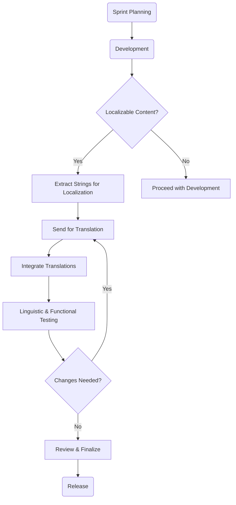

# Introduction to UI Localization

**UI Localization** (User Interface Localization) refers to the process of adapting the user interface of a software application to suit different languages, regions, and cultural contexts. It is a crucial aspect of software development, especially for applications that target global audiences. Localization goes beyond simple translation and includes adjusting various elements of the UI to meet the cultural and regional preferences of users in different locations.

> 

## Key Aspects of UI Localization

### 1. Text Translation
- The most obvious part of localization is translating text (such as labels, buttons, error messages) from one language to another.
- It's important to ensure that the meaning remains accurate across different languages, as direct word-for-word translations often lead to misunderstandings.

### 2. Number, Date, and Time Formats
- Different regions use different formats for numbers, dates, and times. For example:
  - **Number formats**: In the US, `1,000.50` is written as `1.000,50` in many European countries.
  - **Date formats**: The US uses `MM/DD/YYYY`, while many European countries use `DD/MM/YYYY`.
  - **Time formats**: 24-hour clock vs. 12-hour AM/PM system.

### 3. Currency and Units
- Applications handling financial transactions need to display the correct currency symbol (€, $, ¥) and possibly convert between currencies based on the region.
- Measurements might also differ: miles versus kilometers, pounds versus kilograms, Fahrenheit versus Celsius.

### 4. Text Expansion
- Some languages require more space to express the same message. For instance, a sentence in German or French can be longer than its English counterpart.
- The UI needs to accommodate text expansion without breaking the layout or cutting off important information.

### 5. Directionality (RTL and LTR)
- Languages like Arabic and Hebrew are written from right to left (RTL), while most languages like English are written from left to right (LTR). The UI needs to support both layouts.
- RTL support affects not only text direction but also how elements are positioned on the screen (e.g., buttons may switch sides).

### 6. Cultural Sensitivity
- Symbols, icons, colors, and even certain words or phrases may carry different meanings in various cultures. For example, the color white often symbolizes purity in Western cultures but can represent mourning in some Asian cultures.
- It's important to localize these aspects to avoid offending or confusing users.

### 7. Locale-Specific Imagery and Icons
- Certain images or symbols might not make sense in all cultures. For example, using a mailbox icon for "email" might not be understood in countries where that type of mailbox isn't common.
- Icons, illustrations, and even logos may need to be adapted to suit different regions.

### 8. Legal and Compliance Requirements
- Some regions have legal requirements for data display, privacy notices, and disclaimers. For instance, the EU requires adherence to GDPR for privacy concerns, which means certain UI elements must be added or adapted based on the user's location.

## Localization vs. Internationalization

- **Internationalization (i18n)**: The process of designing and developing a software application so it can be easily localized for different languages and regions. It’s the preparation stage where developers ensure the app is adaptable.
- **Localization (l10n)**: The actual adaptation of the application to a specific language or region by translating text, changing formats, and adjusting UI elements based on cultural preferences.

## Tools and Technologies for UI Localization

Several tools and technologies help developers in localizing UIs efficiently:

- **Resource Files**: Developers store strings in external resource files (e.g., `.properties` files in Java, `.resx` files in .NET, or JSON files) to easily switch between different languages.
- **Localization Libraries/Frameworks**: Popular libraries such as `i18next` (for JavaScript), `gettext` (for C/C++), and `String.format()` (for Java) are often used for handling localized content dynamically.
- **Automated Translation Services**: Platforms like Google Translate API or Microsoft Translator API can help with automated translations, but human translation is still essential for accuracy and cultural appropriateness.
- **Translation Management Systems (TMS)**: Tools like Crowdin, Transifex, or PhraseApp streamline the translation process, enabling collaboration between developers, translators, and localizers.
   - **Example**
    - Alchemy catalyst:  Alchemy Catalyst is a software localization tool by professional translators that includes translation memory technology which means that the translator does not have to translate sentences repeatedly. [Alchemy software](https://www.alchemysoftware.com/)

  - SDL Trados: SDL Trados is the market-leading computer-assisted translation software suite, originally developed by the German company Trados GmbH and currently available from language service provider SDL International. [SDL Trados](https://www.trados.com/)

  

## Benefits of UI Localization

1. **Enhanced User Experience**: Users are more comfortable and engaged when an application speaks their language and follows their cultural norms.
2. **Global Reach**: Localization allows companies to target a global market, making their products accessible to users worldwide.
3. **Competitive Advantage**: An app that is well-localized can have a competitive edge over others that don’t provide such flexibility.
4. **Better Brand Perception**: A localized UI shows that a company values and respects the diversity of its users.

## Conclusion

UI localization is an essential practice in modern software development, especially for global applications. It requires careful consideration of linguistic, cultural, and technical factors to ensure a seamless user experience across different regions and languages. Proper planning, internationalization, and use of the right tools can greatly simplify the localization process and help deliver a product that resonates with users worldwide.

----------------------------

# Agile Methodology & Localization Process
## Introduction
Agile is a project management methodology that focuses on iterative development, collaboration, and flexibility. It is widely used in software development and is a perfect fit for projects that require regular feedback and adaptation. The localization process, which involves adapting products for different languages and regions, can be effectively integrated into Agile workflows to ensure fast, high-quality releases for global markets.

### Agile Principles

The core principles of Agile are:

1. Customer collaboration: Working closely with the customer to ensure their needs are met.
2. Responding to change: Being flexible to adapt to new requirements or feedback.
3. Iterative development: Delivering small, functional increments of the product regularly.
4. Cross-functional teams: Involving people from different disciplines, such as developers, designers, testers, and translators.

### Localization Process in Agile
Localization is the process of adapting content (software, websites, documentation) to different languages and cultural contexts. Integrating localization into an Agile workflow ensures that internationalization happens simultaneously with product development. This reduces time-to-market for global products.  

### Key Steps in Localization:
1. Content Extraction: Extract content (strings, UI elements) to be localized.
2. Translation: Translate the content into target languages.
3. Integration: Integrate translated content back into the product.
4. Testing: Perform linguistic and functional testing.
5. Feedback & Iteration: Based on feedback, refine the localization and repeat as needed.

### Agile Localization Flow
In an Agile workflow, localization happens continuously with each sprint. Here’s how it fits in:

1. Sprint Planning: Identify features and content that require localization.
2. Development: Developers and localization engineers collaborate to extract localizable content.
3. Translation & Integration: Translators work in parallel with development to provide translations.
4. Testing: Localized versions are tested for both functionality and linguistic accuracy.
5. Review: Continuous review and feedback ensure the quality of translations and user experience.

### Benefits of Agile Localization
  - Faster Time-to-Market: Localization is done in parallel with development, ensuring quicker releases.
  - Continuous Improvement: Iterative sprints allow for regular feedback and refinements.
  - Cross-Functional Collaboration: Teams of developers, translators, and testers work together seamlessly.
  - Quality Assurance: Continuous testing ensures both functional and linguistic accuracy of the localized product.

-----------------------------------
## Why UI Localization is Essential for Global Success

### 1. Accessibility
Localized user interfaces (UI) make digital platforms accessible to a wider audience by removing language barriers. This enables more users, including those with limited proficiency in the platform's original language, to navigate and understand the content effectively.

### 2. Usability
Localization enhances usability by adapting the UI to cultural and regional nuances. By providing familiar language and symbols, users can interact more comfortably and confidently, leading to an intuitive and user-friendly experience.

### 3. Brand Image
A well-localized UI fosters trust and loyalty among users in different regions. When a brand provides a personalized experience in the user’s native language, it demonstrates respect for their culture, enhancing the brand’s reputation and fostering long-term relationships.

### 4. Legal Compliance
In some regions, legal regulations require software to be available in specific languages. By localizing the UI, companies can comply with these regulations, avoiding legal issues and demonstrating commitment to regional standards.

### 5. Competitive Advantage
Offering a localized experience can set a brand apart from competitors who only offer services in a single language. By making products accessible to a global audience, companies can attract a diverse customer base and stand out in competitive markets.

### 6. Improved User Experience
Localized UIs improve the overall user experience by making content more relevant and easy to understand. This leads to greater user satisfaction, lower frustration levels, and a more engaging platform, ultimately increasing user retention.

### 7. Reduced Support Costs
When users understand the interface in their native language, they are less likely to encounter issues or require assistance. This reduces the demand on customer support teams and lowers operational costs associated with troubleshooting language-related issues.

### 8. Increased Market Share
Localization opens doors to new markets by making products accessible to non-native speakers. As the user base expands, so does the market share, giving companies the potential to reach new customers across different regions and cultures.

---

### Summary
UI localization is a strategic investment that improves accessibility, usability, and user experience, while also enhancing brand image, ensuring legal compliance, and boosting competitive advantage. By localizing, companies can reduce support costs and gain access to a larger, more loyal global audience.

